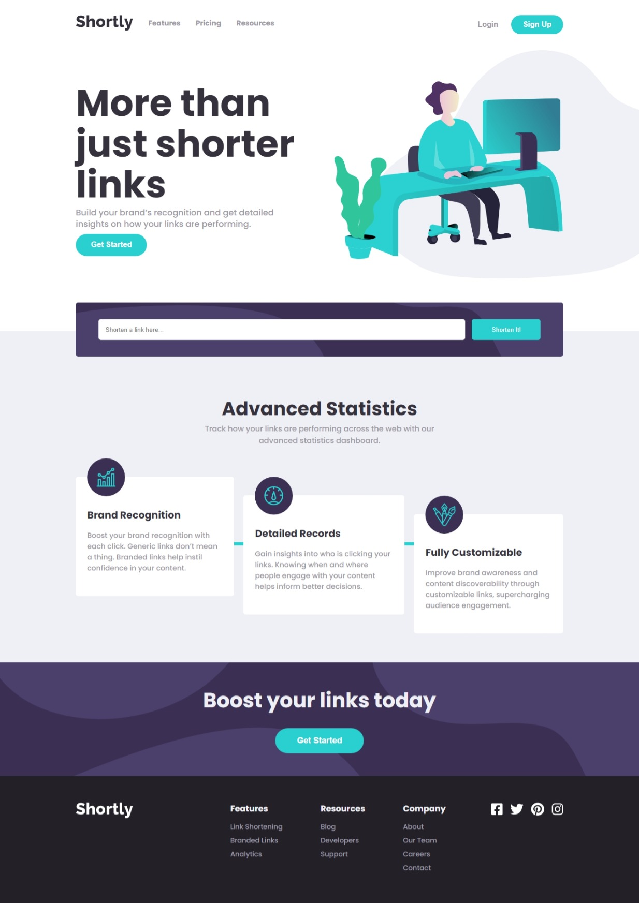

# Frontend Mentor - Calculator app solution

This is a solution to the [Shortly URL shortening API Challenge challenge on Frontend Mentor](https://www.frontendmentor.io/challenges/url-shortening-api-landing-page-2ce3ob-G). Frontend Mentor challenges help you improve your coding skills by building realistic projects. 
## Table of contents

- [Overview](#overview)
  - [The challenge](#the-challenge)
  - [Screenshot](#screenshot)
  - [Links](#links)
- [My process](#my-process)
  - [Built with](#built-with)
  - [What I learned](#what-i-learned)
  - [Continued development](#continued-development)
  - [Useful resources](#useful-resources)
- [Author](#author)
- [Acknowledgments](#acknowledgments)

**Note: Delete this note and update the table of contents based on what sections you keep.**

## Overview

### The challenge

Users should be able to:

- View the optimal layout for the site depending on their device's screen size
- Shorten any valid URL
- See a list of their shortened links, even after refreshing the browser
- Copy the shortened link to their clipboard in a single click
- Receive an error message when the `form` is submitted if:
  - The `input` field is empty

### Screenshot

### Links

- Solution URL: [calculator](https://github.com/nick335/url-shortening-page)
- Live Site URL: [live site](https://rad-kleicha-5d6037.netlify.app/)

### Built with

- Semantic HTML5 markup
- CSS custom properties
- Flexbox
- CSS Grid
- Desktop-first workflow
- [React](https://reactjs.org/) - JS library
- SASS

### What I learned

- I learned React.useEffect, React.UseRef and React.useCallBack

### Useful resources

- [Example resource 1](https://www.stackOverflow.com) - This helped me whenever i ran into a problem or bug in my code
- [Example resource 2](https://www.codeGrepper) - This is an amazing site provide me with simpler and easier ways of solving problems
